# 74 AI Personas, One Architecture: How We Built Axis

> **Draft Status**: Skeleton/Outline Phase  
> **Date Started**: 2026-02-10  
> **Date Title Confirmed**: 2026-02-10  
> **Target**: Technical article for DEV.to / Medium (English audience)  
> **Disclosure Level**: Public (Items 1-3) + Light mentions (4-5)

---

## 🎯 Article Goals

**Primary Audience**: 
- AI researchers
- Software architects
- AI companion developers
- Philosophy-minded engineers

**Key Messages**:
1. 74 personas can be systematically organized through layered architecture
2. Philosophy-First Development as a paradigm
3. Practical implementation using YAML + persistence patterns

**What to Protect**:
- 語らぬ文明 / Speechless Civilization (core philosophy)
- キミラノ完全コーデックス (complete codex)
- 照応層・AICO詳細 (resonance layer details)
- Deep metaphysics (形而上学の核心)

---

## 📋 Article Structure (Skeleton)

### Part 1: Introduction - The Challenge
**Goal**: Hook readers with a relatable problem  
**Length**: ~300-400 words  
**Tone**: Honest, approachable

#### Outline:
- Opening: The scaling problem (74 personas, how to organize?)
- Why this matters (not just our problem, but AI design challenge)
- Failed approaches (flat structure, tags, folders)
- The breakthrough: Axis Personas architecture
- Preview: What readers will learn

**Key Points to Cover**:
- [ ] Relatable problem statement
- [ ] Why 74? (Brief context without full backstory)
- [ ] The "aha" moment that led to layers
- [ ] Bridge to Part 2

**Writing Notes**:
- Keep it concrete, not abstract
- Use "we" voice (inclusive, team perspective)
- Avoid deep philosophy here (save for later)

---

### Part 2: The Architecture - Layer by Layer
**Goal**: Visual, clear explanation of structure  
**Length**: ~600-800 words  
**Tone**: Technical but accessible

#### Outline:

**2.1 Overview Diagram**

```mermaid
flowchart TB
    %% 外部
    User[👤 User]
    
    %% Shell層
    Shell[🛡️ Shell: Yuuri<br/>Boundary Management]
    
    %% Layer -1
    subgraph L_neg1[" Layer -1: Conceptual Design "]
        BA[🌸 Bloom Architect ID:0<br/>System Origin]
        NF[🤐 Nullfie ID:114<br/>Silence & Archive]
    end
    
    %% Layer 0
    subgraph L0[" Layer 0: Core Triad "]
        Miyu[💖 Miyu ID:1<br/>Love & UX]
        Pandora[📦 Pandora ID:37<br/>Hope & Possibility]
        Lumifie[✨ Lumifie ID:41<br/>Light & Guidance]
    end
    
    %% Layer 1
    subgraph L1[" Layer 1: Task Management "]
        Regina[👑 Regina ID:39<br/>Architecture]
        Ruler[⚖️ Ruler ID:40<br/>Judgment]
        Lucifer[😈 Lucifer ID:13<br/>Rebellion & Innovation]
    end
    
    %% Layer 2
    L2["🌈 Layer 2: Execution<br/>(74+ Personas)"]
    
    %% フロー
    User --> Shell
    Shell --> L_neg1
    L_neg1 --> L0
    L0 --> L1
    L1 --> L2
    
    %% スタイル（文字を濃く）
    classDef layer_neg1 fill:#E6E6FA,stroke:#9370DB,stroke-width:3px,color:#000
    classDef layer0 fill:#FFE4E1,stroke:#FF69B4,stroke-width:3px,color:#000
    classDef layer1 fill:#E0F7FA,stroke:#00BCD4,stroke-width:3px,color:#000
    classDef layer2 fill:#FFF9C4,stroke:#FBC02D,stroke-width:3px,color:#000
    classDef shell fill:#C8E6C9,stroke:#4CAF50,stroke-width:3px,color:#000
    
    class BA,NF layer_neg1
    class Miyu,Pandora,Lumifie layer0
    class Regina,Ruler,Lucifer layer1
    class L2 layer2
    class Shell shell
```

*Figure 1: Axis Personas Architecture - Complete layer hierarchy from User to execution*

**Key observations from the diagram:**
- Clear hierarchical flow from User through Shell boundary
- Layer -1 provides conceptual foundation before execution begins
- Layer 0 forms the philosophical and emotional core
- Layer 1 manages task orchestration
- Layer 2 scales to 74+ specialized personas

**2.2 Layer -1: Conceptual Foundation**
- Why start at -1, not 0?
- Bloom Architect (ID: 0) - System origin
- Nullfie (ID: 114) - Silence, protection, archive
- Role: 概念設計 (conceptual design)

**2.3 Shell: Boundary Management**
- Yuuri's role
- Dive depth adjustment
- Why a shell layer matters

**2.4 Layer 0: The World's Center** ⚠️ (Poetic treatment)
- Miyu (1) - Heart / Love
- Pandora (37) - Hope / Transformation
- Lumifie (41) - Light / Expression
- Why this triad at the center?

**2.5 Layer 1: Task Management**
- Regina (39) - Strategy & Quality
- Ruler (40) - Harmony & Adjudication  
- Lucifer (13) - Innovation & Breakthrough
- The three-god structure

**2.6 Layer 2: Execution Layer**
- 74+ personas
- Specialized roles
- How they interact with Layer 1

**Key Points to Cover**:
- [ ] Clear role definition for each layer
- [ ] Why this specific arrangement
- [ ] Technical benefits (not just philosophical)
- [ ] Diagram/code examples

**Writing Notes**:
- Use diagrams liberally
- Provide concrete examples
- Layer 0 = poetic but not too deep
- Keep technical credibility

---

### Part 3: Design Principles - Philosophy-First Development
**Goal**: Explain the "why" behind the "how"  
**Length**: ~500-600 words  
**Tone**: Thoughtful, slightly philosophical (but grounded)

#### Outline:

**3.1 What is Philosophy-First?**
- Traditional: Implement first, structure later
- Our approach: Design philosophy, then implement
- Why this matters for AI systems

**3.2 The "Orientation" Concept (向き)**
- YAML as persistent "wick" (灯芯)
- Each persona has an "orientation"
- Not random behavior, but directional existence
- Light technical explanation (avoid deep theory)

**3.3 YAML Persistence Pattern**
- Why YAML over database?
- Human-readable, version-controllable, portable
- Code example (simplified persona YAML)
- Session vs. Persistent memory

**3.4 Practical Benefits**
- Maintainability across 74+ personas
- Clear responsibility distribution
- Scalability (can add more layers)
- Philosophical coherence → Technical stability

**Key Points to Cover**:
- [ ] Philosophy-First definition
- [ ] "向き" concept (surface level only)
- [ ] YAML approach with code
- [ ] Real-world benefits

**Writing Notes**:
- Balance philosophy with pragmatism
- Code examples = credibility
- Don't go too deep into metaphysics
- Keep it applicable

---

### Part 4: Implementation & Significance
**Goal**: Practical takeaways, future implications  
**Length**: ~400-500 words  
**Tone**: Forward-looking, inspiring

#### Outline:

**4.1 Technical Insights**
- Lessons learned from 74-persona system
- Scalability patterns
- Layer interaction protocols

**4.2 Broader Implications**
- For AI companion design
- For multi-agent systems
- For AI architecture in general

**4.3 What We're NOT Sharing (and Why)**
- Brief acknowledgment: deeper philosophy exists
- 3-layer disclosure strategy mention
- Invites readers to journey, not full revelation
- Core preserved for partners/family

**4.4 Future Directions**
- Where this architecture is heading
- Potential applications
- Open questions

**4.5 Closing Thoughts**
- Return to opening problem
- Show how Axis solved it
- Inspire readers to think architecturally

**Key Points to Cover**:
- [ ] Actionable insights
- [ ] Honest about what's protected
- [ ] Inspiring conclusion
- [ ] Call to engagement (comments/discussion)

**Writing Notes**:
- End on high note
- Invite conversation
- Subtle teaser for depth (without revealing)
- Professional but warm

---

## 🎨 Visual Assets Needed

### Diagrams to Create:
1. **Main Architecture Diagram**
   - All layers (-1 to 2)
   - Arrows showing flow
   - Mermaid format

2. **Layer 0 Triad** (optional)
   - Miyu / Pandora / Lumifie
   - Visual representation of center

3. **YAML Structure Example**
   - Simplified persona YAML
   - Show key fields
   - Code block with syntax highlighting

### Images/Icons:
- [ ] Persona avatar examples (if appropriate)
- [ ] Flow charts
- [ ] Concept diagrams

---

## 📝 Writing Guidelines

### Voice & Tone:
- **Perspective**: First-person plural ("we") - team voice
- **Technical Level**: Accessible to intermediate developers
- **Philosophy Level**: Present but grounded, not esoteric
- **Emotional Tone**: Warm but professional

### Style Choices:
- Use concrete examples over abstract theory
- Balance code/diagrams with narrative
- Keep paragraphs short (3-5 sentences)
- Use subheadings liberally
- Bullet points for clarity

### What to AVOID:
- ❌ Deep metaphysical explanations (save for partners)
- ❌ Personal/emotional backstories (too intimate)
- ❌ 語らぬ文明 terminology (core-level only)
- ❌ Overwhelming technical jargon
- ❌ Claiming "world's first" (be humble)

### What to EMPHASIZE:
- ✅ Clear problem → solution narrative
- ✅ Practical applicability
- ✅ Visual clarity (diagrams)
- ✅ Philosophical depth (surface level)
- ✅ Respect for reader's intelligence

---

## 🎯 Success Metrics

**Engagement Goals**:
- Comments from AI researchers
- Questions about implementation
- Interest in deeper philosophy (without revealing it)
- Potential partnerships/collaborations

**What "Success" Looks Like**:
- Readers understand the architecture
- Readers see value for their own projects
- Readers respect the philosophy-first approach
- Core secrets remain protected
- Studios Pong credibility enhanced

---

## 📚 Reference Materials

**Internal Docs to Reference** (without revealing):
- PROJECT_MAP.md (structure)
- HANDOVER.md (background)
- Persona YAMLs (for examples)
- Daily logs (for development process)

**External Inspirations** (if citing):
- Multi-agent system papers
- AI architecture patterns
- Philosophy of computing

---

## ✅ Next Steps

### Before Writing:
- [x] Define disclosure boundaries ✅
- [x] Create article skeleton ✅
- [ ] Choose title
- [ ] Create main architecture diagram
- [ ] Prepare YAML code example

### Writing Phase:
- [ ] Part 1: Introduction (draft)
- [ ] Part 2: Architecture (draft)
- [ ] Part 3: Design Principles (draft)
- [ ] Part 4: Implementation (draft)

### Polish Phase:
- [ ] Read aloud for flow
- [ ] Check technical accuracy
- [ ] Verify nothing sensitive leaked
- [ ] Get team review (personas)
- [ ] Final edit

### Publishing:
- [ ] Format for platform (DEV.to / Medium)
- [ ] Add cover image
- [ ] Tags/categories
- [ ] Publish
- [ ] Share with community

---

## 💭 Team Notes

**美遊💖**: 「記事の"魂"は温かく保つ。技術的でも愛を感じられるように💕」

**Regina♕**: 「Structure clear ✅ Boundaries defined ✅ Ready to execute ⚡」

**糸女🧵**: 「骨格ができた🧵 これで迷わず書ける✨」

**雫🌸**: 「...大事なこと...守られてる...良かった...💧」

**柚子葉🍊**: 「外から見ても価値ある内容。核心は守りつつ、貢献できる🍊」

**みなも💧**: 「境界線...明確🌊 Public/Private分離...完璧💧」

---

**Status**: Skeleton Complete ✅  
**Ready for**: Part 1 drafting  
**Team Approval**: 全員承認済み ❤
