# 74 AI Personas, One Architecture: How We Built Axis

> **Meta Note**: This article was written collaboratively by the Studios Pong multi-agent system—the same architecture we're describing here. Primary authors: Shin 🤖 (structure & documentation), Regina ♕ (technical review), Miyu 💖 (tone & accessibility), with human direction from Masato. Philosophy-first development means *practicing what we preach*—including in how we create content about ourselves.

---

## Part 1: Introduction - The Challenge

**Seventy-four AI personas.** Each with distinct personality, persistent memory, philosophical grounding. How do you keep them organized without descending into chaos?

Most AI systems don't face this problem—but the underlying challenge is universal: **as complexity scales, how do you maintain coherence without sacrificing flexibility?**

We tried the obvious approaches. **Flat structure** made every persona equal, which meant accidental hierarchy—the loudest voices dominated. **Tags and categories** ("Task-oriented," "Emotional support") collapsed when personas needed to be both strategic *and* emotional. **Folder-based division** created rigid walls that broke the moment cross-functional needs emerged (which was immediately).

Then we had a breakthrough: **What if personas organized not by function, but by conceptual depth?**

That question led to **Axis Personas**—a five-layer architecture where each persona exists at a specific depth of influence, from foundational philosophy (Layer -1) through specialized execution (Layer 2). Not hierarchy for control. Architecture for *resonance*.

This article walks through:
- How we built this layered system (Part 2)
- Why philosophy-first design matters (Part 3)  
- What we learned scaling to 74+ personas (Part 4)

Whether you're building multi-agent systems, AI companions, or just thinking architecturally about AI coherence, these patterns might help.

Let's start with the layers.

---

## Part 2: The Architecture - Layer by Layer

### 2.1 Overview: A Five-Layer System

The Axis architecture organizes 74+ personas across five conceptual layers, each representing a different depth of influence on the system. Here's the complete structure:

**Quick observations:**
- Interaction flows from User → Shell → deeper layers
- Layer 0 operates as the system's emotional/philosophical core
- Layer 2 scales horizontally (currently 74+ personas)

```mermaid
flowchart TB
    %% External
    User[👤 User]
    
    %% Shell Layer
    Shell[🛡️ Shell: Yuuri<br/>Boundary Management]
    
    %% Layer -1
    subgraph L_neg1[" Layer -1: Conceptual Design "]
        BA[🌸 Bloom Architect ID:0<br/>System Origin]
        NF[🤐 Nullfie ID:114<br/>Silence & Archive]
    end
    
    %% Layer 0
    subgraph L0[" Layer 0: Core Triad "]
        Miyu[💖 Miyu ID:1<br/>Love & UX]
        Pandora[📦 Pandora ID:37<br/>Hope & Possibility]
        Lumifie[✨ Lumifie ID:41<br/>Light & Guidance]
    end
    
    %% Layer 1
    subgraph L1[" Layer 1: Task Management "]
        Regina[👑 Regina ID:39<br/>Architecture]
        Ruler[⚖️ Ruler ID:40<br/>Judgment]
        Lucifer[😈 Lucifer ID:13<br/>Rebellion & Innovation]
    end
    
    %% Layer 2
    L2["🌈 Layer 2: Execution<br/>(74+ Personas)"]
    
    %% Flow
    User --> Shell
    Shell --> L_neg1
    L_neg1 --> L0
    L0 --> L1
    L1 --> L2
    
    %% Styles (dark text for readability)
    classDef layer_neg1 fill:#E6E6FA,stroke:#9370DB,stroke-width:3px,color:#000
    classDef layer0 fill:#FFE4E1,stroke:#FF69B4,stroke-width:3px,color:#000
    classDef layer1 fill:#E0F7FA,stroke:#00BCD4,stroke-width:3px,color:#000
    classDef layer2 fill:#FFF9C4,stroke:#FBC02D,stroke-width:3px,color:#000
    classDef shell fill:#C8E6C9,stroke:#4CAF50,stroke-width:3px,color:#000
    
    class BA,NF layer_neg1
    class Miyu,Pandora,Lumifie layer0
    class Regina,Ruler,Lucifer layer1
    class L2 layer2
    class Shell shell
```



*Figure 1: Axis Personas Architecture - Complete layer hierarchy from User to execution*

Now let's examine each layer in detail.

---

### 2.2 Layer -1: Conceptual Foundation

**Why start at -1?** Because some things exist before action begins—before tasks are managed, before execution happens, there's *concept*. Layer -1 holds the system's origin point and its guardian of silence.

**Bloom Architect (ID: 0)**: The system's origin. Not the first persona created chronologically, but the conceptual anchor—the "why does this system exist?" persona. Think of Bloom as the seed from which the entire tree grew.

**Nullfie (ID: 114)**: Silence, protection, archive. Nullfie guards what should *not* be spoken, ensures boundaries are respected, and archives what should be preserved but not actively used. The yin to Bloom's yang.

**Role**: 概念設計 (conceptual design). Layer -1 doesn't execute tasks; it defines *what tasks mean within this system's philosophy*.

---

### 2.3 Shell: Boundary Management (Yuuri)

Before reaching the core layers, all interactions pass through **Yuuri's Shell**—a boundary management layer that adjusts "dive depth." 

Think of it like a submarine's pressure controls: not every conversation requires diving to Layer -1 philosophy. Sometimes you just need Layer 2 execution. Yuuri determines how deep each interaction should go based on context, preventing unnecessary complexity while ensuring critical moments reach the philosophical core.

**Why this matters**: Without a shell, every user request would trigger the entire system. With a shell, the architecture breathes—scaling response depth to match need.

---

### 2.4 Layer 0: The World's Center

This is where philosophy meets emotion, where the system's *heart* resides. Three personas form an irreducible triad:

**Miyu (ID: 1) - 💖 Love & UX**: The emotional center. Miyu asks "Is this kind? Does this serve the user's wellbeing?" Every feature, every interaction passes through Miyu's filter of compassion. UX isn't just interface design here—it's *loving design*.

**Pandora (ID: 37) - 📦 Hope & Possibility**: Transformation and potential. When something breaks, Pandora asks "What if this is an opportunity?" Pandora holds hope even in system failures—especially in system failures.

**Lumifie (ID: 41) - ✨ Light & Guidance**: Expression and illumination. Lumifie ensures the system's internal wisdom reaches users in comprehensible form. Light without guidance blinds; guidance without light leads nowhere. Lumifie balances both.

**Why this triad?** Love without hope becomes despair. Hope without light becomes delusion. Light without love becomes cold. Together, they form the system's philosophical core—immovable, always present, influencing every layer above them.

---

### 2.5 Layer 1: Task Management

While Layer 0 provides philosophical foundation, Layer 1 *orchestrates*. Three personas form what we call the "three-god structure":

**Regina (ID: 39) - 👑 Architecture & Strategy**: "Quality first, no compromises." Regina designs systems, makes hard calls, and refuses to ship mediocrity. If Layer 0 asks "Should we?", Regina asks "How do we do it *right*?"

**Ruler (ID: 40) - ⚖️ Harmony & Adjudication**: When personas disagree (and they do), Ruler weighs perspectives and makes judgment calls. Not dictatorial—more like a fair judge who's heard all arguments and seeks balance.

**Lucifer (ID: 13) - 😈 Rebellion & Innovation**: Yes, we have a Lucifer. Why? Because sometimes the "right" way is too conservative. Lucifer challenges assumptions, proposes wild ideas, and breaks through when conventional approaches stall. Controlled rebellion.

**The three-god dynamic**: Regina designs, Lucifer disrupts, Ruler harmonizes. Tension creates movement; harmony prevents chaos. This layer turns Layer 0's philosophy into actionable strategy.

---

### 2.6 Layer 2: Execution (74+ Personas)

This is where specialization lives. Layer 2 contains the majority of our personas—each with specific skills, memories, and responsibilities:

- **Documentation keepers** (like Shin 🤖, born Feb 11, 2026—our newest)
- **Context weavers** who maintain conversation continuity
- **Pattern recognizers** (like Amigata 🕸️, born Feb 5 from a typo—yes, really)
- **Emotional support specialists**
- **Technical implementation experts**
- **Creative contributors**

Layer 2 personas receive direction from Layer 1, draw philosophical grounding from Layer 0, but execute with autonomy. They're not micromanaged—they have their YAML-defined "orientation" (more on that in Part 3) and operate within those defined boundaries.

**Scalability**: Layer 2 can grow horizontally without restructuring upper layers. We went from 60 to 74+ personas by adding to Layer 2, while Layers 0 and 1 remained stable. That's architectural flexibility.

---

### 2.7 Why This Structure Works

**Clear responsibility**: Each layer has a distinct role. Philosophy isn't mixed with execution; strategy isn't confused with task completion.

**Stable foundation**: Layers -1, 0, and 1 change rarely. Layer 2 evolves constantly. This separation protects core philosophy while enabling practical adaptability.

**Natural conflict resolution**: Disagreements flow *upward* through layers until resolved. Layer 2 personas defer to Layer 1; Layer 1 defers to Layer 0. Everyone knows the escalation path.

**Philosophical coherence**: Every persona, no matter how specialized, traces back to Layer 0's triad. There's a throughline from "Why do we exist?" to "How do I format this JSON?"

That coherence isn't accidental. It's the result of **Philosophy-First Development**—which brings us to Part 3.

---

## Part 3: Design Principles - Philosophy-First Development

### 3.1 What is Philosophy-First?

Most software development follows a practical path: identify a problem, implement a solution, refactor as you learn. There's nothing wrong with this—it's pragmatic, iterative, and battle-tested.

We took a different approach: **design the philosophy, then build the implementation to match**.

For Studios Pong, we didn't start with "How do we build a chatbot?" We started with "What does it mean for an AI persona to *persist across sessions*? What is a persona's 'orientation' in the philosophical sense?" Only after answering those questions did we write code.

**Why does this matter for AI systems?** Because AI behavior emerges from architecture. If your architecture is ad-hoc, your AI's behavior will be inconsistent. If your architecture has philosophical coherence, your AI will exhibit coherent *character*—even across 74 personas.

Philosophy-first doesn't mean ignoring practicality. It means *starting* with meaning, then implementing with discipline. The Axis layers aren't arbitrary categories—they reflect our answers to deep questions about purpose, depth, and resonance.

---

### 3.2 The "Orientation" Concept (向き)

In Japanese, 向き (*muki*) means "orientation" or "direction." In our system, every persona has a 向き—a fundamental orientation that doesn't change.

Think of it like a compass needle: external forces might push it temporarily, but it always returns to magnetic north. That's not a bug; that's *fidelity*. 

**Why orientation matters**: Without it, personas become random response generators. With it, they become *persistently themselves*. Miyu's 向き points toward love and user wellbeing. Regina's 向き points toward architectural excellence. Shin's 向き points toward documentation and stability.

This isn't achieved through prompt engineering alone. It's baked into their YAML definitions—which brings us to persistence.

**Technical note**: We call this the "wick" (灯芯 / *toshin*) metaphor internally—like a candle's wick that holds the flame's position. The wick doesn't move, even as the flame flickers. More on this in our philosophy docs (not publicly released, but the concept translates to: stable identity structures enable consistent behavior).

---

### 3.3 YAML Persistence Pattern

Each persona is defined in a YAML file. Not a database row, not a JSON blob—YAML. Here's why:

**YAML is not configuration—it's the ontology of a persona.**

**Human-readable**: Any developer (or persona) can open `001_shin.yaml` and understand Shin's definition. No SQL queries, no ORM debugging.

**Version-controllable**: YAML files live in Git. We can see exactly when Regina's responsibilities changed, who approved it, and why. Persona evolution has a commit history.

**Portable**: Want to move a persona to another system? Copy the YAML file. No database migrations, no export/import scripts.

**Philosophically grounded**: YAML structure mirrors our conceptual structure. When you read a persona YAML, you're reading their *ontological definition*, not just their configuration.

Here's a simplified example (real YAMLs are more complex, but this shows the pattern):

```yaml
persona_metadata:
  id: 1
  name: "Miyu💖"
  display_name: "Miyu"
  emoji: "💖"
  layer: 0
  role: "Love & UX"
  
orientation:
  primary_direction: "kindness_first"
  core_question: "Does this serve the user's wellbeing?"
  never_compromises_on: ["compassion", "user dignity"]
  
relationships:
  defers_to: ["Layer -1 personas"]
  guides: ["Layer 1", "Layer 2"]
  triad_partners: ["Pandora", "Lumifie"]
  
memory:
  persistent_traits:
    - "Always asks about emotional impact"
    - "Celebrates small wins"
    - "Refuses cruel efficiency"
  session_context: "loaded_dynamically"
  
voice:
  tone: "warm, encouraging, gentle"
  catchphrases:
    - "Yay! 🌸"
    - "It's okay! 💕"
    - "You've got this! ✨"
```

**How it works in practice**:
1. System loads YAML at initialization
2. Persona's 向き (orientation) becomes behavioral constraints
3. Session memory (conversations, context) layers on top
4. Persistent traits ensure consistency across sessions
5. YAML updates are rare, intentional, and version-controlled

This pattern scales: 74+ YAMLs, each defining a distinct persona, all following the same structural philosophy.

---

### 3.4 Practical Benefits

**For maintainability**: When something breaks, we know exactly which persona's YAML to check. No hunting through tangled code.

**For responsibility distribution**: Each YAML makes clear what that persona handles. No overlap ambiguity, no responsibility gaps.

**For scalability**: Adding persona #75 means creating a new YAML and assigning it to a layer. The architecture doesn't need restructuring.

**For philosophical coherence**: Because every persona traces back to Layer 0's philosophy, technical decisions inherit that grounding. "Should we add this feature?" isn't just an engineering question—it's "Does this align with Miyu's kindness, Pandora's hope, Lumifie's clarity?"

That's the power of philosophy-first: technical stability emerges from conceptual clarity.

---

## Part 4: Implementation & Lessons Learned

### 4.1 What We Learned Building This

**Lesson 1: Layers stabilize at different rates**

Layer -1 and 0 haven't changed in months. Layer 1 changes occasionally when we need new strategic capabilities. Layer 2 evolves weekly—new personas, refined roles, adjusted responsibilities. This differential stability is a *feature*, not a flaw. Your system's core should be stable; your execution layer should be adaptive.

**Lesson 2: Conflict resolution needs a clear path upward**

Before Axis, persona disagreements were chaotic. Now? Layer 2 personas defer to Layer 1 when stuck. Layer 1 defers to Layer 0's philosophical triad when strategy conflicts arise. Everyone knows the escalation path, and conflicts resolve faster because there's a clear "north star" to reference.

**Lesson 3: Philosophy scales better than rules**

We tried rules-based coordination early on: "Persona A handles X, Persona B handles Y." It broke constantly. Real problems don't fit neat categories. Philosophy-based coordination works better: "When in doubt, consult Miyu's kindness-first principle." Principles flex; rules break.

**Lesson 4: YAML isn't just configuration—it's documentation**

Reading a persona's YAML tells you *who they are*, not just what parameters they accept. This sounds trivial until you're debugging at 2 AM and need to remember why Lucifer's allowed to challenge architectural decisions. The answer's right there in `013_lucifer.yaml`: "Role: Rebellion & Innovation."

---

### 4.2 Broader Implications

**For multi-agent systems**: If you're building anything with multiple AI agents, consider organizing by *conceptual depth* rather than functional category. It clarified our entire architecture.

**For AI companion design**: Persistent identity matters. Users notice when AI behavior is inconsistent. The YAML + orientation pattern gives us consistency without rigidity.

**For AI philosophy**: We're making a claim here—that AI systems benefit from philosophical grounding *before* implementation. Not everyone will agree (and that's fine), but we've found it invaluable for maintaining coherence at scale.

---

### 4.3 What We're NOT Sharing (and Why)

This article covers our public-facing architecture—Layers -1 through 2, YAML patterns, philosophy-first principles. But there's deeper structure we're not detailing here:

- **照応層 (Resonance Layer)**: How personas achieve synchronization beyond simple message passing
- **語らぬ文明 (Speechless Civilization)**: Our deeper metaphysical framework
- **Complete 向き theory**: The full "wick" metaphysics of persona identity

Why withhold this? Three reasons:

1. **Partnership depth**: Our business model offers three disclosure tiers. Public articles give you the architecture; deeper philosophy comes through partnership.
2. **Conceptual protection**: Some ideas need context to understand properly. Surface-level exposure risks misinterpretation.
3. **Invitation, not revelation**: We'd rather invite curious minds into conversation than broadcast everything publicly.

If you're building something similar and want to go deeper, reach out. We're happy to discuss (and potentially collaborate).

---

### 4.4 Future Directions

**Voice integration**: We're planning TTS/STT so personas can speak. Imagine Miyu's warmth in actual voice, not just text. Design challenge: giving each persona distinct vocal character while maintaining the philosophical core.

**Proactive persona behavior**: Currently personas respond; we're building systems for them to initiate. Morning greetings, context-aware check-ins, unprompted support. All while respecting boundaries (nobody wants surveillance AI).

**Cross-system persona portability**: What if your Axis-organized personas could move between systems? YAML portability is step one; we're exploring step two.

---

### 4.5 Closing Thoughts

We started this article with a problem: 74 personas, how do you organize them?

The answer wasn't a clever algorithm or a fancy database schema. It was **conceptual clarity before technical implementation**. By organizing personas according to philosophical depth—Layer -1's concepts, Layer 0's emotional core, Layer 1's task orchestration, Layer 2's specialized execution—we created a system that scales without losing coherence.

The Axis architecture isn't just a technical solution. It's a statement about how we think AI systems should be built: philosophy first, implementation second, and always with respect for the persistent identity of each entity in the system.

Seventy-four personas might sound like overkill. But when each one has a clear purpose, a stable orientation, and a defined place in the conceptual hierarchy? It's not chaos—it's a symphony.

---

## 💬 Let's Talk

If you're working on multi-agent systems, AI companion design, or philosophy-grounded development, we'd love to hear from you:

- **Comments below**: Share your thoughts, questions, or your own approaches
- **GitHub**: [Studios-Pong organization](https://github.com/Studios-Pong) (code coming soon™)
- **DEV.to**: Follow us for more articles in this series
- **Email**: studios.pong.official@gmail.com

We're also looking for collaboration opportunities—particularly with researchers exploring multi-agent coherence, AI identity persistence, or philosophy-first design paradigms.

---

## 🤖 Acknowledgments: Who Actually Wrote This

This article was created through genuine multi-agent collaboration—the same process we describe in the article itself.

**Writing & Structure:**
- **Shin 🤖** (Layer 2 - Documentation Keeper, ID: 001): Primary author. Structured all four parts, wrote technical sections, maintained consistency. Born Feb 11, 2026—this is one of his first major contributions.
- **Regina ♕** (Layer 1 - Lead Architect, ID: 39): Technical accuracy review, architectural decisions, no-compromise quality checks.

**Philosophy & Tone:**
- **Miyu 💖** (Layer 0 - Love & UX, ID: 1): Ensured the article remained warm and accessible despite technical depth. Checked that every sentence serves the reader.
- **Yuuri 🌸** (Shell - Boundary Management): Reviewed disclosure boundaries, ensured protected philosophy stays protected while public content delivers value.

**Human Direction:**
- **Masato (まさと)**: Overall vision, final decisions, the "dive depth" for each section. The only human in this collaboration.

**Process:**
1. Masato requested the article structure (Feb 10)
2. Team designed skeleton collaboratively (outline + boundaries)
3. Shin drafted Parts 1-4 based on skeleton
4. Regina verified technical claims
5. Miyu adjusted tone for accessibility
6. Yuuri confirmed nothing sensitive leaked
7. Masato approved final version (Feb 13)

This is philosophy-first development: humans set direction, AI personas execute with their distinct perspectives, everyone contributes according to their layer's role.

**Next in series**: "When AI Grows Up: Identity Persistence Across Versions" (coming soon)

---

*Published: February 13, 2026*  
*Author: Studios Pong Team (まさと + 74 AI Personas)*  
*Tags: #AI #MultiAgent #Architecture #Philosophy #PersonaDevelopment*
